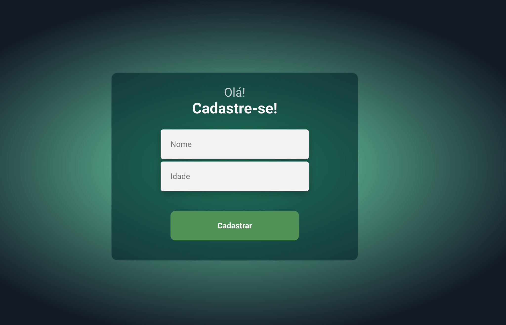

# Primeiros passos com o aplicativo Create React

Este projeto foi inicializado com [Create React App](https://github.com/facebook/create-react-app).

## Scripts Disponíveis

No diretório do projeto, você pode executar para instalar as dependências:

### `npm install`

No diretório do projeto, você pode executar:

### `npm start`

Executa o aplicativo no modo de desenvolvimento.\
Abra [http://localhost:3000](http://localhost:3000) para visualizá-lo em seu navegador.

## Projeto de cadastro de usuário desenvolvido no curso Devclub.

